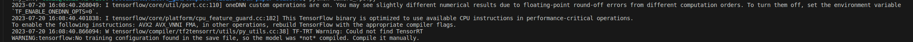
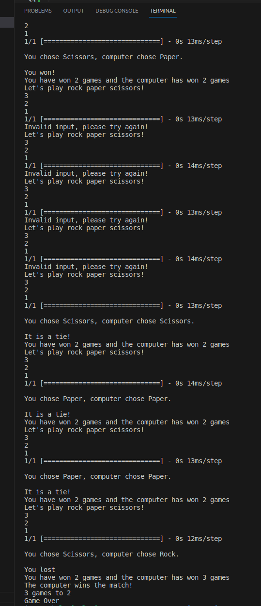

# Computer Vision Rock Paper Scissors

Rock-Paper-Scissors (RPS) is a game in which each player simultaneously shows one of three hand signals representing rock, paper, or scissors. Rock beats scissors. Scissors beats paper. Paper beats rock. The player who shows the first option that beats the other player's option wins. This is an implementation of an interactive Rock-Paper-Scissors game, in which the user can play with the computer using the camera.

## Milestone 1: Set up the environment

Set up GitHub repo using the button on AiCore project page. 

## Milestone 2

* Created an image project model with four different classes: Rock, Paper, Scissors and Nothing.
* Used Teachable-Machine to train each class with images of myself showing each option to the camera. At the time I had the curtains closed due to morning sun exposure so the background is quite dark, hopefully this does not cause interpretation issues when testing out the model.
* I used approx 1000 images for each class and tried to capture as many angles of possible of the correct hand gestures to increase probability of successful results.
* Downloaded the image model to my local machine.
* Push the model and label to GitHub repo.
* Began documenting my experience.

## Milestone 3

* Created a conda environment called the my_env and activated it, I had some issues getting conda to work. An update to 
* Installed pip and the libraries opencv-python, tensorflow and ipykernel
* Created a requirements.txt file by running 'pip list > requirements.txt'
* Tested the model with the RPS-Template file provided, unsure if result is what is intended but it did open the webcam. After further exploration it seems the code is not working correctly for reasons I am unsure of but I have the following message:  
After some feedback I have learned the model is working sufficiently to proceed so have spent some time studying the code to understand the model.

## Milestone 4

* Created functions to store the users and computers choices called get_user_choice and get_computer_choice respectively. Where the user choice requests input and the computer choice is generated randomly from a list: Rock, Paper, Scissors.
* Created function get_winner to  which prints out both the user and computer choices and then the result. Firstly it capitalizes the user choice to allow for lower case input of the valid user choices. It also generates an "Invalid input" message if the input does not meet this criteria.
* Created function to simulate the game using a while loop to try the code again if the user input is not valid.
* Ran tests and debugged, seems to work as expected but Task 2 validation is generating feedback that if there is a tie, the output is incorrect. After many minor adjustments and tweaks to the code and wording of the output statements I realised that where i had included a print out of each players choice before the result output, this was interferring with the task verification. I switched this to print after the result and can now move on.
* The next task verification to fail was due to my README file not having enough characters, updated README to include a more detailed account of my experiences.

## Milestone 5

Putting it all together was the biggest challenge and also the greatest learning curve. I explored many different ways of writing the code, watched some youtube videos for ideas and browsed a fair few RPS tutorials.

* Created a new file camera_rps.py for the computer vision model version of RPS.
* Replaced the get_user_choice() function with get_prediction(), which uses the numpy.argmax() function to return the indices of the max element of the keras_model.h5 probability array.
* Added a gesture map and mapper function to asign a the gesture to prediction.
* Created the function get_image() which turns on the camera and captures the users image.
* Added a countdown timer function that prints 3, 2, 1 before capturing the users image. Avoided using the time.sleep() function as suggested in the milestone instructions.
* Added a function track_wins() to track the wins of each player for the purpose of a 'first to 3' wins the match. I tried a variety of code suggestions for this, the one I settled on uses a while loop to count the players wins and breaks the code once either reaches 3 wins. Updated the get_winner() function  
* I had some issues with the reliability of the computer vision model so added back in the get_user_choice() function with the purpose of looping the code if the user gesture was not recognised.

At this point I had consistant code that performed to an adequate standard, I created a class RockPaperScissorsGame and added the __init__ magic method. I removed any unecessary lines of code and updated the latest changes to GitHub

## Further improvements and suggestions

* #### Refine the computer vision model
As I used the webcam to create each class there and then and did not upload any other images, I found that the computer vision model was very accurate on the day of recording but would struggle to recognise my gestures on any other day, this leads me to conclude changes in background, lighting, the clothing I wore and how close i was to the camera etc, were influencing it's accuracy. I could usually get it to work after a few goes as the following output demonstrates.

This could be improved upon by refining the computer vision model with a wider variety of images from different settings but where my gestures remain the same, though it would likely still perform poorly with users other than myself.

* Explore other computer vision models
* Improve readability by adding comments and a docstring
* Have the countdown display on the camera
* Improve on presentation

## Summary

I had a lot of fun on this project, my first time putting what I have learned so far into practice, whilst also learning much, much more in the process. I do recommend the project for newcomers to programming who want to further their understanding and implementation.